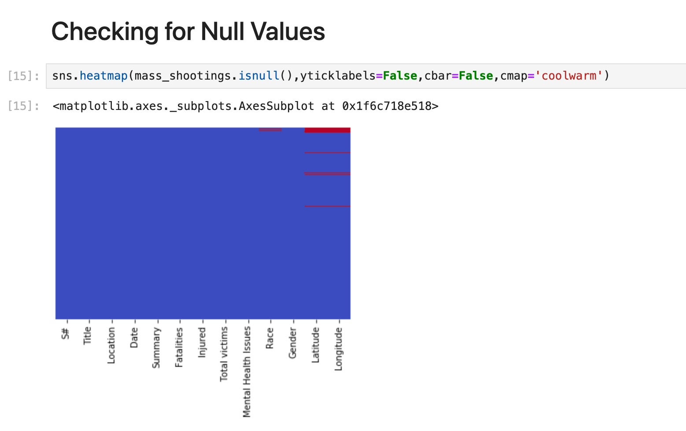
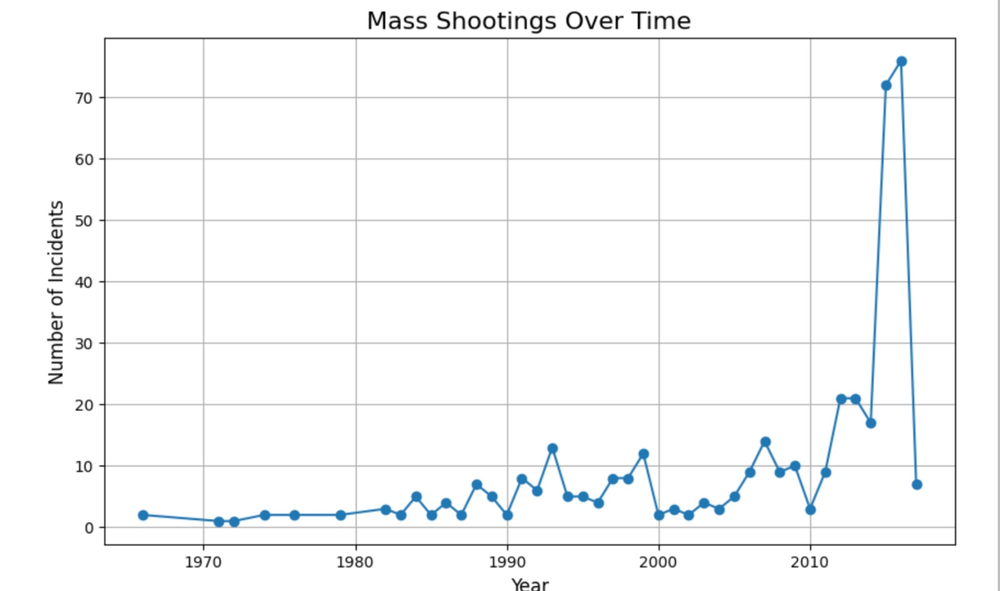
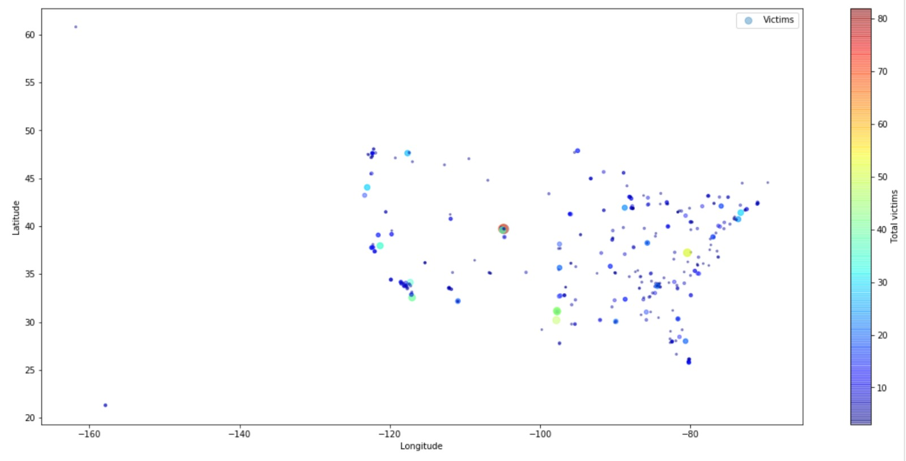

# US Mass Shooting Analysis 📊

This project performs an in-depth analysis of mass shootings in the United States. It explores trends, correlations, and insights using Python, data visualization, and machine learning techniques. The notebook provides step-by-step analysis, from data loading to insights generation.

---

## 📋 Table of Contents

1. [Project Overview](#project-overview)
2. [Features](#features)
3. [Setup Instructions](#setup-instructions)
4. [Usage](#usage)
5. [Technologies](#technologies)
6. [Screenshots](#screenshots)
7. [License](#license)

---

## 🔍 Project Overview

Mass shootings have become a growing concern in the United States. This project aims to uncover trends, identify key contributing factors, and explore actionable insights using data-driven techniques.

---

## ✨ Features

- **Data Cleaning and Preparation**:
  - Handles missing values and formats data for analysis.
- **Exploratory Data Analysis (EDA)**:
  - Trend analysis over time.
  - Correlation analysis with external factors (e.g., mental health, gun laws).
- **Visualization**:
  - Heatmaps, scatter plots, and time series graphs to represent data effectively.
- **Machine Learning**:
  - Clustering and predictive modeling to identify patterns.

---

## 🛠️ Setup Instructions

1. Clone the repository:
   ```bash
   git clone <https://github.com/saisnehasv/US_Mass_Shooting_Analysis>
   ```

2. Install the required dependencies:
   ```bash
   pip install -r requirements.txt
   ```

3. Launch Jupyter Notebook:
   ```bash
   jupyter notebook
   ```

4. Open the `Mass Shootings.ipynb` file to explore the analysis.

---

## 🖥️ Usage

1. **Load the Dataset**:
   - Replace the file path in the `pd.read_csv()` function with the location of your dataset.

2. **Run the Notebook**:
   - Execute cells sequentially to reproduce the analysis.

3. **Customize the Analysis**:
   - Update the code to add new visualizations or algorithms.

---

## 💻 Technologies

- **Languages**:
  - Python
- **Libraries**:
  - NumPy, Pandas: Data manipulation
  - Matplotlib, Seaborn: Visualization
  - Scikit-learn: Machine learning
- **Environment**:
  - Jupyter Notebook

---

## 🖼️ Screenshots

### Data Cleaning and Analysis


### Visualization of Trends Over Time


### Correlation Heatmap


---

## 📜 License

This project is licensed under the MIT License. See the LICENSE file for details.

---
